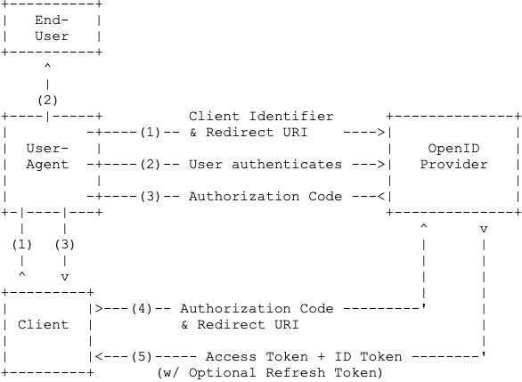

# Flow

OpenID Connect Core specifies three paths via which authentication can be performed: the *Authorization Code Flow*, the *Implicit Flow* and the *Hybrid Flow*. The flows determine how the ID Token and Access Token are returned to the Client.

This profile requires that authentication is performed using the Authorization Code Flow, in where all tokens are returned from the Token Endpoint.

The Implicit Flow and Hybrid Flow allow tokens to be obtained from the Authorization Endpoint, and thereby omitting the Token endpoint. This  makes them vulnerable to token leakage and token replay and makes it impossible to cryptographically bind tokens to a certain Client.

Therefore, the Implicit Flow and Hybrid flow MUST NOT be used. Also, the IETF OAuth Working Group is removing support for the Implicit Flow from the OAuth 2.1 specification [[?OAuth2.1]] for the same reasons.

### Authorization Code Flow

The Authorization Code Flow returns an Authorization Code to the Client, which can then exchange it for an ID Token and an Access Token directly. The flow comprises the following steps:

1. The Client sends an Authorization Request - containing the desired request parameters - to the OpenID Provider.
2. The OpenID Provider authenticates the End-User.
3. The OpenID Provider sends the End-User back to the Client with an Authorization Code.
4. The Client requests a response using the Authorization Code at the Token Endpoint.
5. The Client receives a response that contains an ID Token and Access Token in the response body.
6. The Client validates the ID token and retrieves Claims and Subject Identifier(s) of the authenticated End-User.

The flow described by these steps is illustrated as follows:

<figure id='authorization_code_flow'>
  
  <figcaption>Authorization Code Flow</figcaption>

</figure>
