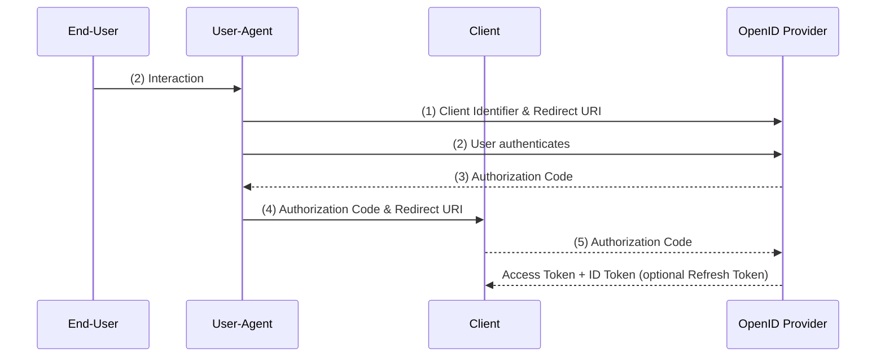

<figure id='authorization_code_flow'>

```mermaid
sequenceDiagram
    participant EndUser as End-User
    participant UserAgent as User-Agent
    participant Client as Client
    participant OP as OpenID Provider

    EndUser ->> UserAgent: (2) Interaction
    UserAgent ->> OP: (1) Client Identifier & Redirect URI
    UserAgent ->> OP: (2) User authenticates
    OP -->> UserAgent: (3) Authorization Code
    UserAgent ->> Client: (4) Authorization Code & Redirect URI
    Client -->> OP: (5) Authorization Code
    OP -->> Client: Access Token + ID Token (optional Refresh Token)
```

</figure>